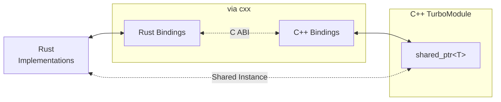

# Introduction

::: warning
This project is currently under development and is in early beta. For more information about the stable release, please refer to the following [link](https://github.com/leegeunhyeok/craby/issues/1)
:::

## What is Craby?

Craby is a type-safe Rust development tool for React Native. It automatically generates Rust/C++ bindings from TypeScript schemas and integrates directly with **pure C++ TurboModule**, bypassing platform-specific layers like `ObjCTurboModule` and `JavaTurboModule`.

## Motivation

React Native provides [TurboModule](https://reactnative.dev/docs/turbo-native-modules-introduction), a JSI (JavaScript Interface) integration layer built on C++. To support platform-specific languages (Kotlin/Java for Android, Objective-C/Swift for iOS), it implements compatibility layers like `ObjCTurboModule` and `JavaTurboModule`, which introduce some overhead compared to pure C++ implementations.

Craby was created to address this performance gap by enabling direct integration with pure C++ TurboModule using [Rust](https://rust-lang.org). By bypassing platform compatibility layers and leveraging Rust/C++ FFI, it aims to deliver zero-overhead performance.

For most use cases requiring platform-specific features (e.g., camera access, sensors, native UI components), TurboModule remains the better choice. However, when maximum performance is critical—such as efficient large-scale data processing, cryptographic operations, or real-time data parsing—Craby offers a compelling alternative.

Craby solves these problems by:

1. **Pure C++ Integration**: Direct integration with C++ TurboModule bypasses platform-specific layers for maximum performance
2. **Auto Code Generation**: Define your API once in TypeScript, and Craby generates all the necessary Rust and C++ bridging code
3. **Type Safety**: Compile-time type checking across TypeScript, Rust, and C++ prevents runtime errors
4. **Simple Development**: Focus on implementing your business logic in Rust—Craby handles the rest

## Key Features

### Performance

Craby achieves superior performance through:

- **Pure C++ Integration**: Direct integration with C++ TurboModule bypasses platform-specific layers (`ObjCTurboModule`, `JavaTurboModule`)
- **Zero-Cost FFI**: Rust-to-C++ communication via [cxx](https://cxx.rs/) ensures zero-overhead interop with compile-time safety
- **Template-Based Types**: C++ templates provide type-safe, compile-time conversions between user-defined types across the TypeScript-Rust-C++ boundary

---

[This benchmark](https://github.com/leegeunhyeok/NitroBenchmarks) compares the total execution time when calling a single native method `100,000` times:

| Module       | `addNumbers`   | `addStrings`   |
| ------------ | -------------- | -------------- |
| ExpoModules  | 445.21ms (x83) | 427.21ms (x27) |
| TurboModules | 116.13ms (x21) | 175.27ms (x11) |
| NitroModules | 7.07ms (24%)   | 28.53ms (80%)  |
| CrabyModules | **5.32ms**     | **15.75ms**    |

Note: These benchmarks only compare native method throughput in extreme cases, and do not necessarily reflect real world use-cases. In a real-world app, results may vary. See [repository](https://github.com/leegeunhyeok/NitroBenchmarks) for full context.

### Automatic Code Generation

Never write boilerplate again. Craby analyzes your TypeScript specs and generates:

- Rust struct, trait definitions
- C++ bridging implementations
- Native build configurations (e.g., CMake)

### Type Safety

Craby ensures type consistency across the entire stack:

- TypeScript types → Rust types & C++ types
- Compile-time validation prevents mismatched types
- Rich type support including objects, arrays, enums, promises, and nullable types

### Simple Integration

With Craby, you focus on what matters—your implementation:

```rust
#[craby_module]
impl CalculatorSpec for Calculator {
    fn add(&mut self, a: Number, b: Number) -> Number {
        // Focus on what matters!
    }
}
```

## When to Use Craby

Ideal use cases:

<div class="tossface">

- <span class="tossface">✅</span> Performance-critical native modules (e.g., large-scale data processing, cryptographic operations, real-time parsing)
- <span class="tossface">✅</span> High-performance file I/O operations with large datasets
- <span class="tossface">✅</span> Building high-performance modules in Rust with type safety

</div>

Cannot be used for:

<div class="tossface">

- <span class="tossface">❌</span> Modules requiring platform-specific features (e.g., camera access, sensors, native UI components)
- <span class="tossface">❌</span> Modules requiring standard TurboModule capabilities (e.g., event emitters, platform context access)

</div>

## How It Works



1. **Codegen from TypeScript**: Generate code based on TypeScript NativeModule specifications
2. **Rust Code Generation**: Generate FFI code, user-defined types (structs/enums), and traits to ensure module interface contracts
3. **C++ Code Generation**: Generate pure C++ TurboModule implementations and templates for efficient data interoperability
4. **Integration**: When the React Native application builds, the C++ TurboModule is compiled and integrated into the app

## Next Steps

Ready to get started? Head over to the [Create a Project](/guide/getting-started) guide to create your first Craby module!
