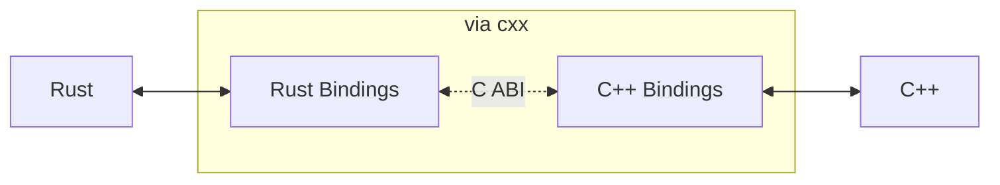

# Introduction

:::warning
This project is currently under development and is in early alpha. For more information about the stable release, please refer to the following [link](https://github.com/leegeunhyeok/craby/issues/1)
:::

## What is Craby?

**Craby** is a type-safe Rust development tool for React Native that bridges the gap between JavaScript and native code. It automatically generates Rust and C++ code based on TypeScript NativeModule schemas and integrates with **pure C++ TurboModule**—no platform-specific interop like `ObjCTurboModule` or `JavaTurboModule` required.

## Motivation

React Native provides excellent **TurboModule** and **Codegen** capabilities. However, it requires using platform-specific languages (Kotlin/Java for Android, Objective-C/Swift for iOS) and goes through platform compatibility layers, which means it cannot match the performance of pure C++ TurboModules.

Craby was created as an alternative solution to address these limitations. It aims to integrate seamlessly with pure C++ TurboModules using the Rust language. While platform-specific features are not available, Craby strives to be the best choice for maximum performance.

### The Solution

Craby solves these problems by:

1. **Pure C++ Integration**: Direct integration with C++ TurboModule bypasses platform-specific layers for maximum performance
2. **Auto Code Generation**: Define your API once in TypeScript, and Craby generates all the necessary Rust and C++ bridging code
3. **Type Safety**: Compile-time type checking across TypeScript, Rust, and C++ prevents runtime errors
4. **Simple Development**: Focus on implementing your business logic in Rust—Craby handles the rest

## Key Features

### Performance

Craby achieves superior performance through:
- **Pure C++ Integration**: Direct integration with C++ TurboModule bypasses platform-specific layers (`ObjCTurboModule`, `JavaTurboModule`)
- **Zero-Cost FFI**: Rust-to-C++ communication via [cxx](https://cxx.rs/) ensures zero-overhead interop with compile-time safety
- **Template-Based Types**: User-defined types are processed at compile-time using C++ templates, eliminating runtime type conversion overhead

---

[This benchmark](https://github.com/leegeunhyeok/NitroBenchmarks/pull/1) compares the total execution time when calling a single native method `100,000` times:

| Module       | `addNumbers`   | `addStrings`   |
|--------------|----------------|----------------|
| ExpoModules  | 445.21ms (x83) | 427.21ms (x18) |
| TurboModules | 116.13ms (x21) | 175.27ms (x7)  |
| NitroModules | 7.07ms (24%)   | 28.53ms (20%)  |
| CrabyModules | **5.32ms**     | **22.58ms**    |

Note: These benchmarks only compare native method throughput in extreme cases, and do not necessarily reflect real world use-cases. In a real-world app, results may vary. See [repository](https://github.com/leegeunhyeok/NitroBenchmarks) for full context.

### Automatic Code Generation

Never write boilerplate again. Craby analyzes your TypeScript specs and generates:
- Rust trait definitions
- C++ bridging implementations
- FFI layer code
- Native build configurations (CMake, XCFramework)

### Type Safety

Craby ensures type consistency across the entire stack:
- TypeScript types → Rust types → C++ types
- Compile-time validation prevents mismatched types
- Rich type support including objects, arrays, enums, promises, and nullable types

### Simple Integration

With Craby, you focus on what matters—your implementation:

```rust
impl CalculatorSpec for Calculator {
    fn add(&mut self, a: Number, b: Number) -> Number {
        a + b  // Just implement your logic!
    }
}
```

## How It Works



1. **Codegen from TypeScript**: Generate code based on TypeScript NativeModule specifications
2. **Rust Code Generation**: Generate FFI code, user-defined types (structs/enums), and traits to ensure module interface contracts
3. **C++ Code Generation**: Generate pure C++ TurboModule implementations and templates for efficient data interoperability
4. **Integration**: When the React Native application builds, the C++ TurboModule is compiled and integrated into the app 

## When to Use Craby

Craby is ideal for:

<div class="tossface">

- ✅ Building high-performance native modules in Rust
- ✅ Projects requiring complex data processing on native side

</div>

Craby might not be the best fit for:

<div class="tossface">

- ❌ Simple native modules with minimal logic (native JS modules may suffice)
- ❌ Modules requiring platform-specific APIs (use platform-specific modules instead)

</div>

## Next Steps

Ready to get started? Head over to the [Getting Started](/guide/getting-started) guide to create your first Craby module!
